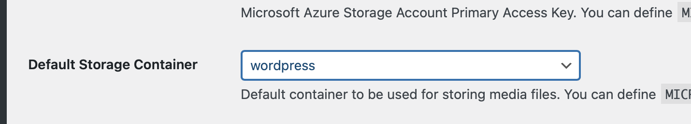

# Projet techique SupDeVinci DevOps MSI 4-23 DO A : Groupe 1

## Pré Requis 

Pour faire les installations, il est nécessaire d'avoir les prérequis suivants :

- Faire un clone du repository :
```
git clone https://github.com/MathieuSchl/projetTechique.git && cd projetTechique/
```
- Avoir un cluster Kubernetes 
- Avoir debian à jour (uniquement en On-Prem)

```sh
sudo apt-get update
```

## Installation de HELM (PAS NECESSAIRE SUR AZURE)

- Installer le paquet `snapd` en exécutant la commande suivante : 

```sh
sudo apt-get install snapd
```

- Installer Helm en utilisant la commande suivante : 

```sh
sudo snap install helm --classic
```

- Pour vérifier que Helm a été correctement installé, exécutez la commande suivante pour afficher la version de Helm : 

```sh
helm version
```
## Installation GALERA
### Edition du fichier values (Gallera)
Le fichier `values` est dans le dossier `gallera/values.yaml`
A la ligne 2, renseigner le mot de passe voulue pour l'utilisateur root de la DB :
```yaml
    rootUser:
      password: "ChangeME"
```

- Lancer l'installation de GALERA via la commande suivante : 

```shell
helm install galera oci://registry-1.docker.io/bitnamicharts/mariadb-galera -f ./Galera/values.yaml
```

Vous devriez voir un pod en running au bout de quelques minutes 
```shell
kubectl get pods 
```


## Installation WORDPRESS

### Edition du fichier values (Wordpress)

Le fichier `values` est dans le dossier `Wordpress/values.yaml`
A la ligne 11 , renseigner le mot de passe que nous avons spécifié plus haut pour [gallera](#Edition-du-fichier-values-gallera)
```yaml
  password: "ChangeMe"
```
Puis a la ligne 4, renseigner le mot de passe qui sera utilisé pour se connecter à l'interface admin de wordpress 
```yaml
wordpressPassword: "ChangeME"
```

- Lancer la commande suivante pour lancer l'installation de WordPress :

```shell
helm install wordpress oci://registry-1.docker.io/bitnamicharts/wordpress -f ./Wordpress/values.yaml
```

## Accéder à  wordpress 
On récupère l'ip externe via la commande 
```shell
kubectl get services wordpress 
```


#### En vous connectant à l'adresse, vous devriez avoir accès à la page suivante :


#### Vous pouvez aussi vous connecter à l'interface  d'admin en  utilisant `http://$ip-externe/admin`, ensuite utiliser les credentials que l'on a renseigné plutôt


#### Une fois connecté, votre installation Wordpress est fonctionnelle


## Création du blob storage
#### Une fois connecter à azure, cherchez storage ou  stockage dans la barre de recherche  puis cliquez sur "comptes de stockage" ou "Storage Account"


#### Ensuite, renseigner le nom du blob, puis cliquer sur review


#### Enfin cliquer sur créer 


#### Pour créer un conteneur dans ce storage account, cliquez sur "containers" puis sur `create` 


#### A droite entrer un nom et sélectionner "blob" dans public accesss level  enfin cliquez sur create 
 

#### Ensuite cliquer sur le storage account et aller dans la section "access key" ou "clé d'accès" puis afficher et copier la clé d'accès 


## Jointure du blob à wordpress 
### Installation du plugin
Connecter vous à l'interface d'admin [cf](#accéder-à-wordpress)

Cliquer sur `plugins` puis `add new` 


Ensuite dans la barre de recherche saisissez `Microsoft Azure Storage for WordPress` puis cliquer sur `Install Now`


Cliquer ensuite sur "Activate"


### Configuration du plugin 
On accède à la page de configuration d'azure en cliquant sur `Settings` pour sur `Microsoft Azure`


Dans la partie `Store Account Name` renseigner le nom du blob storage créé plus haut 


Dans la partie "Store Account Key" renseigner le secret généré par azure   


Appuyer sur `entrer`, puis cliquez sur le conteneur créé précédemment


Appuyez sur en `Entrer` ou cliquez sur `save change` en bas de page 


