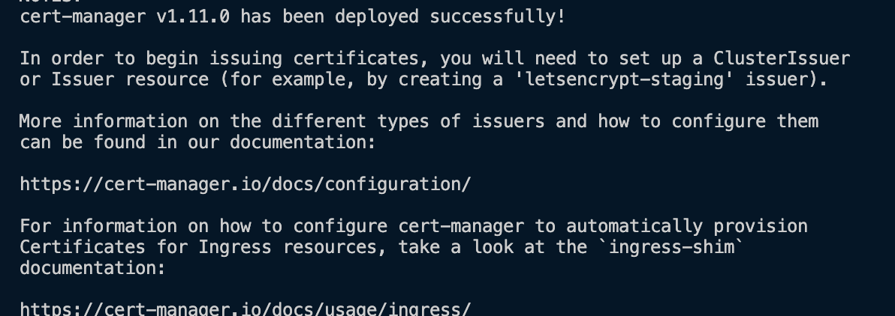
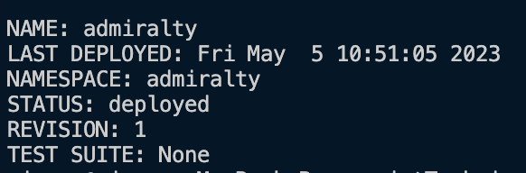
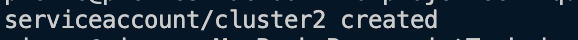
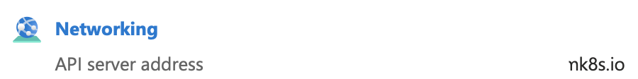

# Projet techique SupDeVinci DevOps MSI 4-23 DO A : Groupe 1 , Partie 2 

## Pré Requis 

Pour faire les installations, il est nécessaire d'avoir les prérequis suivants :

- Faire un clone du repository :
```
git clone https://github.com/MathieuSchl/projetTechique.git && cd projetTechique/
```
- Avoir au moins deux  cluster Kubernetes Azure, dans des régions différente   
- Avoir helm et jq d'installés, 

/!\ pour la simplicité de ce guide, les deux cluster azure seront nommés cluster1 et cluster2


## instalation de cert manager  ( cluster1 et cluster2)
admiralty a besoin de cert-amanger ( sur les deux clusters ) pour pouvoir fonctionner, procéder comme suit pour installer 

on ajoute le repo helm de jetstack 
```
helm repo add jetstack https://charts.jetstack.io
```
vous devriez voir cette sortie 


ou celle ci 


on va ensuite mettre à jour les repo helm 
```
helm repo update
```

a la fin de l'update ce message apparait 


nous allons maintenant procéder à l'installation  de cert-manager 

attention : 
- il ne faut pas avoir de namespace "cert-manager" sur vôtre cluster  ( vérifier avec ``` kubectl get namespaces```)
- il ne faut pas qu'un release helm nommée "cert-mamanger" existe  ( vérifier avec ``` helm list -A```)

on install cert-manager avec la commande suivante  (cela peut prendre plus ou moins de temps en fonction de la puissance du cluster )
```
helm install cert-manager jetstack/cert-manager      --namespace cert-manager --create-namespace     --version v1.11.0 --set installCRDs=true     --wait 
``` 
si tout vas bien ce message appairait


à ce stade, cert-manager est oppérationel.


## instalation d'admirality ( cluster1 et cluster2)

ici encore il faut ajouter le repo helm 
```
helm repo add admiralty https://charts.admiralty.io
```
puis on mets à jour les repos

```
helm repo update
```


nous allons maintenant procéder à l'installation  de Admiralty 

attention : 
- cert-manager doit être installé (  vérifier avec ``` helm list -n cert-manager ```)) si ce n'est pas le cas, suivre cette [procédure](#instalation-de-cert-manager--cluster1-et-cluster2)  
- il ne faut pas avoir de namespace "admiralty" sur vôtre cluster  ( vérifier avec ``` kubectl get namespaces```)
- il ne faut pas qu'un release helm nommée "cert-mamanger" existe  ( vérifier avec ``` helm list -A```)

on lance  l'install d'amdiralty avec la commande suivante :
```
helm install admiralty admiralty/multicluster-scheduler --namespace admiralty --create-namespace  --version 0.15.1 --wait 
```
si tout vas bien, le message suivant apprait 



à ce stade Admiralty est installé  nous pouvons maintenant passé à sa configuration 


## configuration d'admiralty 
### préambule 
À ce stade, nous  allons installer une achitecture type master/slave, le cluster1 sera le master  et le cluster2 le slave
cela veut dire que cluster1 pourra répartir des pods sur les deux cluster, le custer 2 lui ne pourra pas gérer la répartition

### génération d'un compte  de service  ( Cluster2 uniquement)

nous allons créer un compte de service sur le cluster2 qui permettra à notre master (CLuster1) d'envoyer les pods 

pour cela on créer un compte de service  
```
kubectl create serviceaccount cluster1
```
si tout vas bien ce message apparait, 



puis on genère un TOKEN pour ce SA  (/!\\pas d'output pour cette commande)
```
  TOKEN=$(kubectl create token cluster1)
```
nous de vons maintenant récupérer l'ip de l'api de KUB, sur Azure, il faut regarder dans la section networking 


on export cette IP dans une variable IP 
```
IP=cluster.[...].io
```
enfin on génère une config qu'on enverra à CLuster1  (/!\\ le port 443 peut différer en fonction des providers )
```
  CONFIG=$(kubectl config view \
    --minify --raw --output json | \
    jq '.users[0].user={token:"'$TOKEN'"} | .clusters[0].cluster.server="https://'$IP':443"')

```

puis copier dans le presse papier la  valeur de $CONFIG
### configuration du cluster1 
maintenant il va falloir "coller" cette valeur de cluster2 vers cluster1  en rajountant des ' au début et à la fin de la chaine de caractère 

```
$CONFIG = ' {contenu du presse papier} '
```

si tout va bien la valeur de $CONFIG devrait être la même des deux cotés 
```
echo $CONFIG
```

on va maintenant créer un secret pour avoir accéder à cluster2 depuis cluster1 
```
kubectl  create secret generic cluster2     --from-literal=config="$CONFIG"
```

maintenant on va déclarer la target  cluster2 sur cluster1, cela permet de  dire à cluster1  qu'il peut envoyer des pods sur le second cluster (/!\\ ici nous avons mis une target qui aotorise sur tous les namespaces, pour cibler un namespace en particulier , suiver ce [guide](https://admiralty.io/docs/operator_guide/scheduling) )
```
cat <<EOF | kubectl apply -f -
apiVersion: multicluster.admiralty.io/v1alpha1
kind: ClusterTarget
metadata:
  name: cluster2
spec:
  kubeconfigSecret:
    name: cluster2
EOF
```

a ce stade,   un nouveau noeud devrait apparaitre sur  Cluster1 

```
kubectl get nodes 
```


####  répartir la charge sur  cluster1

également on peut déclarer une target  qui  cible le cluster1 en lui même , cela permet de faire toruner des pods sur cluster1 en plus gérer l'orchestration (optionel)
```
cat <<EOF | kubectl apply -f 
apiVersion: multicluster.admiralty.io/v1alpha1
kind: ClusterTarget
metadata:
  name: this-cluster
spec:
  self: true 
EOF
```


### configuration d'une source  sur cluster2 
sur cluster2 on va ajouter uen source, cela permet de dire à cluster2 que cluster1 va lui envoyer des pods 
cluster (/!\\ ici nous avons mis une source qui aotorise sur tous les namespaces, pour cibler un namespace en particulier , suiver ce [guide](https://admiralty.io/docs/operator_guide/scheduling) )
```
cat <<EOF | kubectl  apply -f -
apiVersion: multicluster.admiralty.io/v1alpha1
kind: ClusterSource
metadata:
  name: cluster1
spec:
  serviceAccountName: cluster1
EOF
```