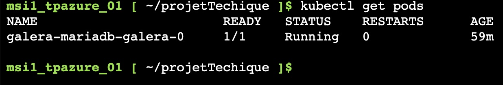
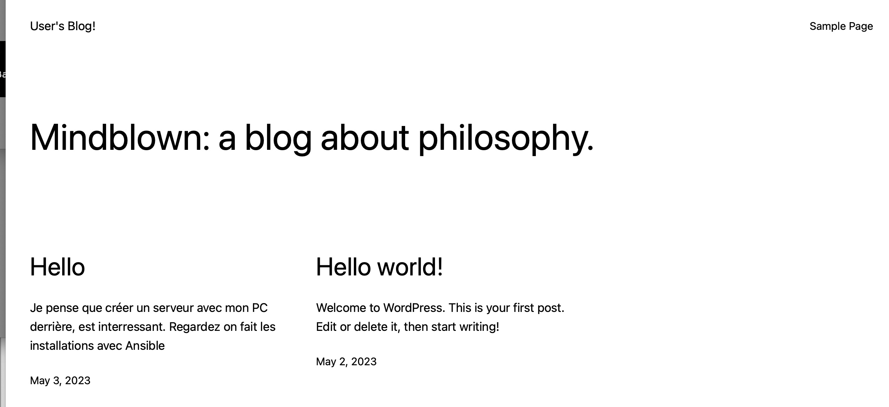
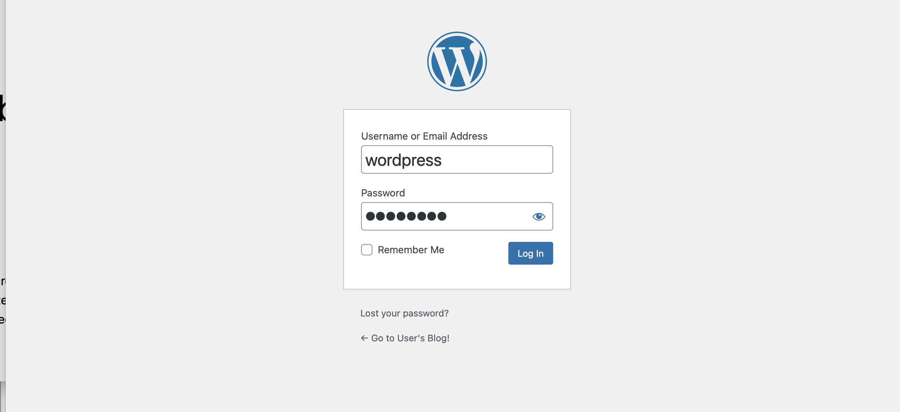
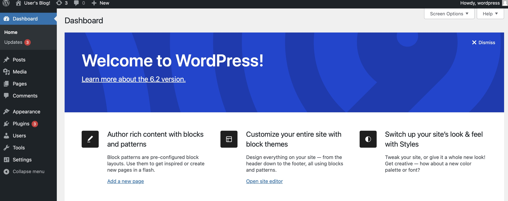
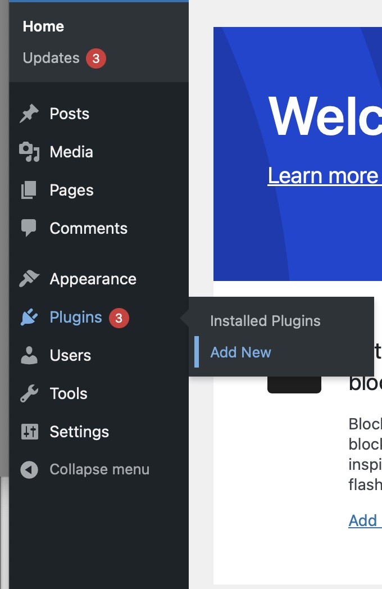
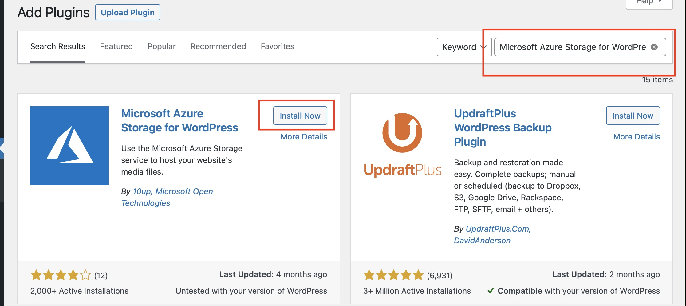
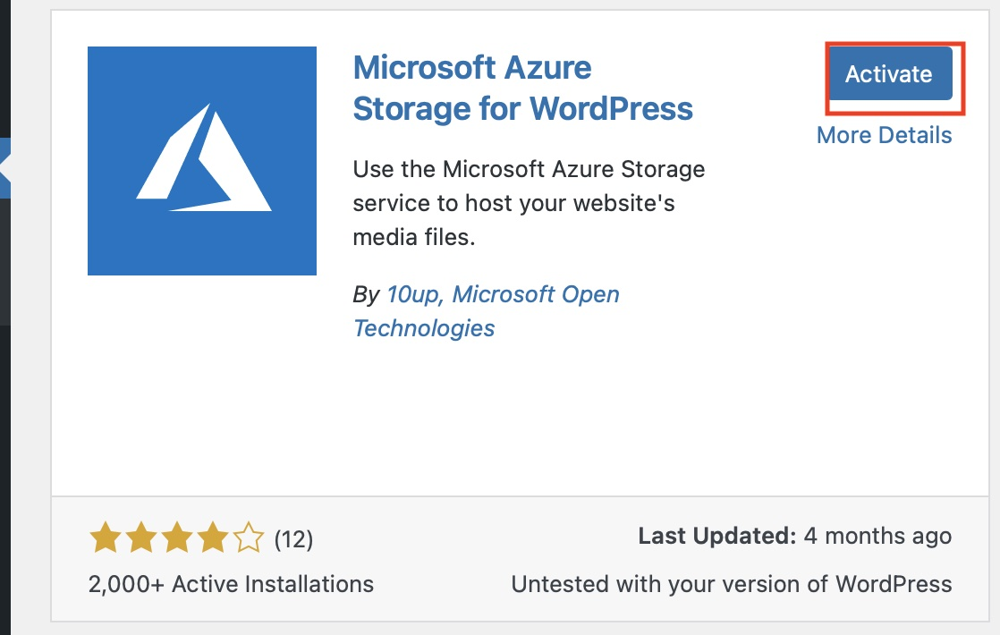
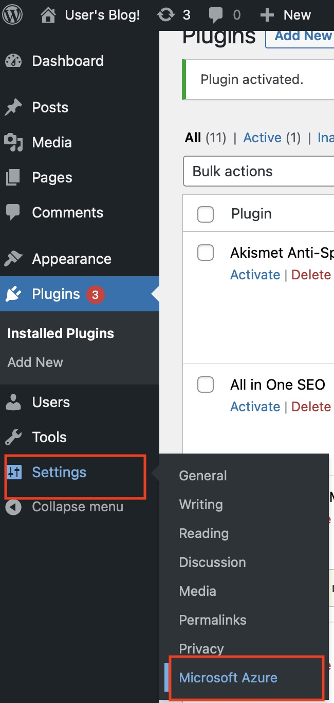

# Projet techique SupDeVinci DevOps MSI 4-23 DO A : Groupe 1

## Pré Requis 

Pour faire les installations, il est nécessaire d'avoir les prérequis suivants :

- Faire un clone du repository :
```
git clone https://github.com/MathieuSchl/projetTechique.git
```
- Avoir un cluster Kubernetes 
- Avoir debian à jour (uniquement en On-Prem)

```sh
sudo apt-get update
```

## Installation de HELM (PAS NECESSAIRE SUR AZURE)

- Installez le paquet `snapd` en exécutant la commande suivante : 

```sh
sudo apt-get install snapd
```

- Installez Helm en utilisant la commande suivante : 

```sh
sudo snap install helm --classic
```

- Pour vérifier que Helm a été correctement installé, exécutez la commande suivante pour afficher la version de Helm : 

```sh
helm version
```
## Installation GALERA
### édition du fichier values (Gallera)
à la ligne 2, renseigner le mot de passe voulue pour l'utilisateur root de la DB :
```yaml
    rootUser:
      password: "ChangeME"
```

- Lancez l'installation de GALERA via la commande suivante : 

```shell
helm install galera oci://registry-1.docker.io/bitnamicharts/mariadb-galera -f ./Galera/values.yaml
```

vous devriez voir un pod en running au bout de quelques minutes 
```shell
kubectl get pods 
```


## Installation WORDPRESS

### édition du fichier values (Wordpress)

à la ligne 11 , renseignez le mot de passe que nous avons spcéifié plus haut pour [galllera](#édition-du-fichier-values-gallera)
```yaml
  password: "ChangeMe"
```
puis a la ligne 4 renseifnez le mot de passe qui sera utilisé pour se connecter à l'interface admin de wordpress 
```yaml
wordpressPassword: "ChangeME"
```

- Lancez la commande suivante pour lancer l'installation de WordPress :

```shell
helm install wordpress oci://registry-1.docker.io/bitnamicharts/wordpress -f ./Wordpress/values.yaml
```


## accéder à  wordpress 
on récupère l'ip externe via la commande 
```shell
kubecetl get services wordpress 
```


en vous connectant à l'adresse ,vous dezvriez avoir accès à la page suivante :


vous pouvez aussi vous connecter à l'interface  d'admin en  utilisant http://$ip-exxterne/admin
ensuite utiliser les crédentials que l'on a renseigné plutôt  


une fois connecté votre installation wordpress est fonctionelle 




## création du blob storage 
une fois connecter à azure ,  cherchez storage ou  stockage dans la barre de recherche  puis cliquez sur "comptes de stockage" ou "Storage Account"


ensuite , renseignez le nom du blob, puis cliquer sur review


enfin cliquer sur créer 


ensuite cliquer sur le conteneur et aller dans la section "access key" ou "clé d'accès" puis afficher et copier la clé d'accès 


## jointure du blob à wordpress 
### installation du plugin
connecter vous à l'interface d'admin [cf](#accéder-à-wordpress)

clliquer sur plugins puis add new 




ensuite dans la barre de recherche saisissez "Microsoft Azure Storage for WordPress" puis cliquer sur "Install Now"


cliquez ensuite sur "Activate"

### configuration du plugin 
on accède à la page de configuration d'azure  en cliquant sur "Settings" pour sur "Microsoft Azure"


dans la partie "Store Account Name"	 renseigner le nom du blob storage créé plus haut 


dans la partie "Store Account Key" renseigner le secret généré par azure   


Appuyer sur entrée , puis clickez sur "-- Create New Container --"  renseigner le nom du nouveau conteneur et cliquez sur  create 

*Attention :*
*Ce nom peut contenir seulemnt des lettres minuscules, des chiffres et des traits d'union. Il doit commencer par une lettre ou un chiffre* *Chaque trait d'union doit être précédé et suivi d'un caractère autre qu'un trait d'union. Le nom doit avoir entre 3 et 63 caractères.*


